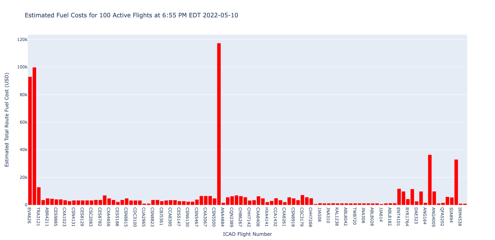
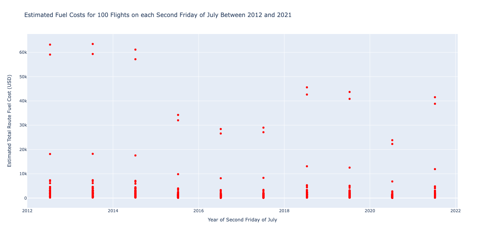

# Aviation Route Fuel Cost Calculator

Introduction
------------------------------------------

This repository contains code, data and visualizations for an aviation route fuel cost calculator. This is an example of a tool that an airline could use to calculate fuel costs for routes over time and for different trip distances. This project combines data from a MySQL database, a MongoDB database and data from the [aviationstack API](https://aviationstack.com) in lightweight JSON format and uses Python to interpret the data, make fuel cost calculations and produce data visualizations using the Plotly express module. 

Description
------------------------------------------

The main file used in this project is `fuelCostCalculator.py` ([src](fuelCostCalculator.py)). This file contains two main functions: `getApiResponse()` and `getRouteFuelCost()`.

#### `getApiResponse()` ####

The `getApiResponse()` function takes as arguments a string to concatenate to the base API request string to form the full API request and a filename to put the response data into. (The verbose argument for both functions is for debugging and is set to False by default.) After checking that the API request string and output filename are valid, the function uses the Python requests module to make a request to the aviationstack API for data in JSON format, then dumping it into a a file with the passed output filename. The data stored in this file is therefore saved can then be used for analysis later. 

#### `getRouteFuelCost()` ####

The `getRouteFuelCost()` function takes in as arguments an International Civil Aviation Organization (ICAO) flight number, the filepath of the data to read from and a date for the fuel cost to use (this is an optional argument), returning the estimated route fuel cost in USD for the given flight. The function first checks that the supplied fuel cost date is in the correct format (`YYYY-MM-DD`), exiting the function if it is not. It then opens the file with the given filepath and loads the data from the JSON file into a Pandas dataframe. The function then searches for the specified flight number in the data. When the desired flight is found, it gets the ICAO airport codes for both the departure and arrival airport. Then, it uses the `sqlalchemy` module to get the relevant airport data from a MySQL database containing airport data. Using the coordinates for both airports, the function then uses the `haversine` module to compute the haversine distance in miles between both airports. The haversine (or great circle) distance is the angular distance between two points on the surface of a sphere and can be used to calculate the distance between two locations on the Earth. After this distance has been calculated, the function then uses different fuel efficiency numbers for different flight ranges taken from common aircraft models that fly each type of route: If the flight distance is less than 1100 miles, the efficiency value from the Bombardier CRJ900 is used, if the flight distance is greater than or equal to 1100 miles and less than 2000 miles, the efficiency value for the Boeing 737-800 is used, if the flight distance is greater than or equal to 2000 miles and less than 5000 miles, the efficiency value for the Boeing 787-8 is used and if the flight distance is greater than or equal to 5000 miles, the efficiency value for the Airbus A350-900 is used. The data sources for the efficiency values can be found below in the [Data Sources](#datasources) section. The function then uses the `pymongo` module to access the MongoDB database containing jet fuel price and gets the data for the specified date. If no date was provided in the function call, the default value of 'today' is used which uses the date '2022-05-02' as this is the most recent data point in the data. This data is then put into a Pandas dataframe and accessed to acquire the fuel price. With all the relevant numbers collected, the function calculates and returns the estimated route fuel cost in USD (rounded to cents), using the flight distance, aircraft efficiency and jet fuel price.

There are two additional Python files in this repository which use the functions above to create the data visualizations that can be found in the `dataVisualizations` folder of this repository. These files are `fuelCostsActiveFlights510.py` ([src](fuelCostsActiveFlights510.py)) and `fuelCosts2012to2021.py` ([src](fuelCosts2012to2021.py)).

#### Fuel Costs for Active Flights on 2022-05-10 ####

The code to create this visualization first calls the `getApiResponse` function to get data for 100 active flights from the aviationstack API. The API request was made on May 10 at 6:55 PM EDT and returned active flight data for that time ([src](data/activeFlights510.json)). I then loaded this data into a Pandas dataframe and looped over each record, calling `getRouteFuelCost` for each flight. I accumulated two lists over the loop containing ICAO flight numbers and route fuel costs for each associated flight respectively. After this, I assembled these lists into a Pandas dataframe (A CSV file containing this data can be found in the `data` folder of this repository in `fuelCostsActiveFlights510.csv` ([src](data/fuelCostsActiveFlights510.csv)).) From there, I used the Ploty Express module to create a histogram of each flight and its associated estimated route fuel cost. An image of this visualization is shown below and an interactive version as well as the source for the image can be found in the `dataVisualizations` folder of this repository in fuelCostsActiveFlights510.html ([src](dataVisualizations/fuelCostsActiveFlights510.html)) and fuelCostsActiveFlights510.png ([src](dataVisualizations/fuelCostsActiveFlights510.png)) respectively.

#### Fuel Costs on each Second Friday of July Between 2012 and 2021 ####

The code to create this visualization also begins with calling the `getApiResponse` function 10 times, getting data for 100 flights from each second Friday of July in 2012 and 2021. This day was chosen to account for seasonal variability in travelling and because it is a common time of the year for air travel during summer vacation. I then loop over every flight in each of the 10 years of data for flights, accumulating the flight date, ICAO flight number and estimated route fuel cost which is again calculated with `getRouteFuelCost`. This data is then assembled into a Pandas dataframe. (A CSV file containing this data can be found in the data folder of this repository in `fuelCosts2012to2021.csv` ([src](data/fuelCosts2012to2021.csv)). I again used the Plotly Express module to create a scatterplot of this data with the date on the x-axis and estimated route fuel cost in USD on the y-axis. An interactive version of this visualization as well as an image can be found in the `dataVisualizations` folder of this repository in fuelCosts2012to2021.html ([src](dataVisualizations/fuelCosts2012to2021.html)) and fuelCosts2012to2021.png ([src](dataVisualizations/fuelCosts2012to2021.png)) respectively. This visualization appeared to have some outliers that had much higher route fuel cost than the majority of the data points. To provide a more sensible presentation of the data, I removed flights with a fuel cost higher than $2000 and created an identical visualization using this data. An image of this visualization is shown below and an interactive version as well as the source for the image can be found in the `dataVisualizations` folder of this repository in fuelCosts2012to2021Sub2000.html ([src](dataVisualizations/fuelCosts2012to2021Sub2000.html)) and fuelCosts2012to2021Sub2000.png ([src](dataVisualizations/fuelCosts2012to2021Sub2000.png)) respectively.

#### Modules used in this Project ####

This project makes use of the following Python modules:

- `haversine` - to compute distance between airports
- `json` - to read and dump JSON data
- `pandas` - to manipulate data
- `plotly` - to make data visualizations using Plotly Express
- `pymongo` - to read from a MongoDB database
- `re` - to use regular expressions for input checking
- `requests` - to make requests to the aviationstack API
- `sqlalchemy` - to read from a MySQL database

Data
------------------------------------------

The following data files were used or produced in this project and can be found in the `data` folder of this repository:

- `activeFlights510.json` - data for 100 active flights at 6:55 PM EDT 2022-05-10 ([src](data/activeFlights510.json))
- `airport-codes.csv` - data that was loaded into a MySQL database containing information on airports worldwide ([src](data/airport-codes.csv))
- `flights712.json` - data for 100 flights on 2012-07-13 ([src](data/flights712.json))
- `flights713.json` - data for 100 flights on 2013-07-12 ([src](data/flights713.json))
- `flights714.json` - data for 100 flights on 2014-07-11 ([src](data/flights714.json))
- `flights715.json` - data for 100 flights on 2015-07-10 ([src](data/flights715.json))
- `flights716.json` - data for 100 flights on 2016-07-08 ([src](data/flights716.json))
- `flights717.json` - data for 100 flights on 2017-07-07 ([src](data/flights717.json))
- `flights718.json` - data for 100 flights on 2018-07-13 ([src](data/flights718.json))
- `flights719.json` - data for 100 flights on 2019-07-12 ([src](data/flights719.json))
- `flights720.json` - data for 100 flights on 2020-07-10 ([src](data/flights720.json))
- `flights721.json` - data for 100 flights on 2021-07-09 ([src](data/flights721.json))
- `fuelCosts2012to2021.csv` - data for estimated route fuel costs for flights on the second Friday of July between 2012 and 2021 ([src](data/fuelCosts2012to2021.csv))
- `fuelCosts2012to2021Sub2000.csv` - data for estimated route fuel costs for flights on the second Friday of July between 2012 and 2021 with fuel costs below $2000 ([src](data/fuelCosts2012to2021Sub2000.csv))
- `jetFuelPrices.csv` - data that was loaded into a MongoDB database containing daily weekday jet fuel spot prices between 1990-04-02 and 2022-05-02 in Dollars per Gallon ([src](data/jetFuelPrices.csv))

Data Sources
------------------------------------------

- [Airport Codes (Datahub)](https://datahub.io/core/airport-codes#resource-airport-codes)
- [U.S. Gulf Coast Kerosene-Type Jet Fuel Spot Price FOB (U.S. Energy Information Administration)](https://www.eia.gov/dnav/pet/hist/eer_epjk_pf4_rgc_dpgD.htm)
- [737 Performance Summary (Boeing)](https://web.archive.org/web/20140725005129/http://www.boeing.com/assets/pdf/commercial/startup/pdf/737ng_perf.pdf)
- [CRJ Family Fuel-Burn Performance (Aircraft Commerce)](http://www.team.aero/files/aviation_data/owners_n_operators_guide_crj.pdf)
- [Redefining the 757 replacement: Requirement for the 225/5000 Sector (Leeham News)](http://leehamnews.com/wp-content/uploads/2015/03/Article-1-main-table2.png)
- [Updated Analysis: Delta Order for A350; A330neo Hinged on Pricing Availability (Airway News)](https://web.archive.org/web/20151117045118/http://airwaysnews.com/blog/2014/11/25/analysis-delta-order-for-a350-a330neo-hinged-on-pricing-availability/)

This project was created as part of the Data Science Systems (DS 3002) course at the University of Virginia in the Spring of 2022.